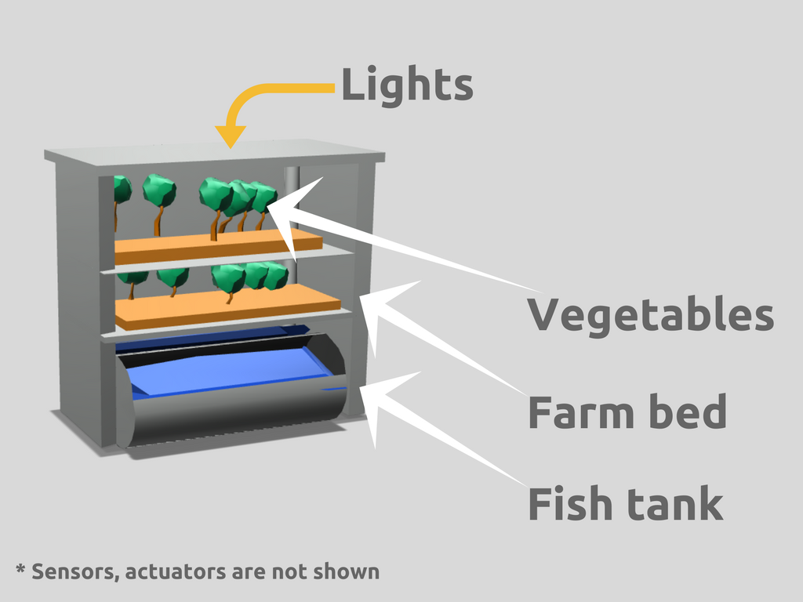
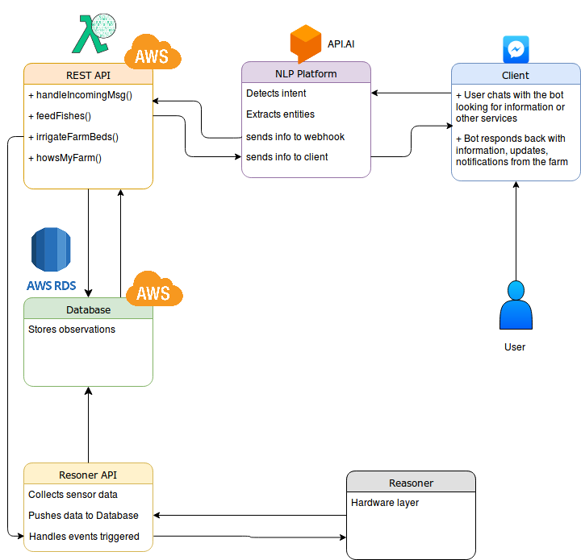

## Plantybot

An Urbanfarming bot that you can chat with. Make fresh, organic produces for your family, right at your home. Let plantybot take care of maintaining your farm.

### What is Plantybot?


*Groot, Gaurdian of the Galaxy (No image copyright)*

Many of us citybred have busy lives and farming may sound like a happy dream to us, but a low priority activity to venture into.

What if we can make healthy produces at home, while putting in minimal time into our farm? This is
where plantybot comes in.

Plantybot is an Internet of things(IoT) solution for in-house farming. The farm is designed as stacks of horizontal planes where green vegetables can be planted. Equipped with sensors, it is self/minimal maintenance. You can talk to plantybot through FB messenger and get notified anytime about the status of your farm. You can even change the parameters like lighting, irrigation, etc.



An interesting way to make the farm self sustainable is to make it an aquaponics ecosystem.

### What's aquaponics?

Aquaponics is a farming technique which combines raising fishes in freshwater (aquaculture) and soil-less farming (hydroponics), making them a self sustaining ecosystem.

Take a look at this video to get more understanding of aquaponics.

<iframe src="https://player.vimeo.com/video/141252002" width="640" height="360" frameborder="0" webkitallowfullscreen mozallowfullscreen allowfullscreen></iframe>
<p><i><a href="https://vimeo.com/141252002">Open Source Aquaponic Greenhouse</a> from <a href="https://vimeo.com/opensourceecology">Open Source Ecology</a> on <a href="https://vimeo.com">Vimeo</a>.</i></p>

### How is it implemented?


*A basic setup*

**Basic workflow**

The water from the fish tank is rich with nutrients from the fish excretions.

We have a pebble farmbed with our plantation.

This water needs to be pumped into the farm beds periodically, and is drained back into the fish tank.

This keeps the water pure, oxygenated for the fishes and inturn provides nutrients for the plants.

**IoT workflow**

The main blocks to the implementation are:

```markdown
1. The farming setup (Physical Mechanism)
2. The sensors and hardware setup (Electronics)
3. REST API (Web Service)
4. Chatbot NLP engine (Artificial Intelligence)
5. A chat client (FB Messenger)
```

These blocks are connected in such a way that a user could maintain their farm
by interacting with an AI chatbot, getting status updates of the farm and requesting
changes to farm parameters.

**Farmbed setup**
Aquaponics farming setup would contain:

```markdown

1. Adding artificial lights (LED strips)
2. Sensors drive the system.
Temperature, pH, water level,
lighting on the irrigation bed etc are monitored
3. Based on the sensing info,
actuators irrigate the bed,
or the fishes are fed
4. The information collected are periodically
updated to a server through a Web-API
5. A chatbot service (messenger based) is connected
to this API and it is used to notify the user
about the health and productivity of your farm
6. Other notifications like when the
fish food storage has to be refilled,
health of fish tank,
emergency alerts etc are also sent
```

### Chatbot architecture

**How to make a messenger bot?**


We are making a messenger bot, a bot user with whom we can chat with from messenger.

**High level steps**
1. We need to register with the facebook developers page and add create the bot user.
2. We then implement a webhook by hosting a web service in AWS Lambda, this is where the messages to the bot user will be handled.
3. We will add AI capabilites as discussed below
4. the responses would be through messenger
5. Actions can be taken on the farm based on the user messages.

References:

1. https://blog.hartleybrody.com/fb-messenger-bot/
2. https://www.fullstackpython.com/blog/build-first-slack-bot-python.html (this one for slack, we can use Microsoft Bot Framework to make this for FB Messenger)
3. https://developers.facebook.com/docs/messenger-platform/getting-started/quick-start/ (FB's docs on making a messenger app)

### How to make the bot AI?

One of the basic concept of making a chatbot into a AI chatbot, is making the bot understand user

**intent**.

For example when the user starts a conversation with the bot by saying "Hi", the bot should understand that the intent is `greeting` and create a response like "Hey there {username}". Some common intents that make our bot sound human:

```markdown
1. greeting (e.g. user says "Good Morning")
2. help (e.g. user says "Can you help me?")
3. status (e.g. user says "how's it going?", 
"how are things in my farm?" etc)
4. customercare (e.g. user says 
"Can I talk to some support?")
5. name (e.g. user asks  plantybot 
for its name "what's your name?")
6. location (e.g. user asks plantybot
"Where do you live?")

```

There are many web services which serve as the bots AI engine. For example https://wit.ai is facebooks Chatbot AI engine, that is free even for commercial use. Other options are API.AI (Googles'), Lex (Amazons), IBM Watson, LUIS (microsofts).

We are going with [API.Ai](https://api.ai) for its scalability and intutive interface.

## In depth Information for Techies

### Hardware prototyping - Raspberry Pi


We intend to develop a ROS based solution on Raspberry Pi for automating the desired, intended aquaponics system on our PlantyBot. The higher level architecture of the system is depicted in the following diagram.


The state information of the system as read by relevant sensors equipped in the system is passed onto a Reasoner. The Reasoner periodically runs algorithms to take decisions on irrigation routines with the collected data. The Reasoner then connects to a Chatbot Application over the web. The Chatbot communicates directly with the User, thereby giving the status of the farm, taking instructions from the user and regularly initiating processes to perform health checkups on the system. The Reasoner along with the Chatbot application forms the core A.I. of the system. The A.I. is backed up by the sensor suite and the actuation system directly controlled through the Raspberry Pi microcomputer. This A.I. based control system represents the overall architecture of the PlantyBot.

On Raspberry pi side, we have four main parts:

1. Sensing
2. Connecting and updating server
3. The default irrigation routine (which can be interrupted by the user through the chatbot side)
4. Actuators

### Sensors

Raspberry Pi, has to collect data, use the Wifi module to connect to the Webhooks and update them regularly (say once every 10mins)

We are using:
1. __Light intensity Sensor__ to measure the amount of light over the minifarm. For this purpose, we intend to choose from the commonly used digital light intensity sensors like __BH1750FVI__ or __TSL2561__, both come with a 16-bit ADC resolution and i2c bus interface.
2. __Temperature sensor__ to measure the temperature of water in fish tank. We intend to use a waterproof, single wire and digital temperature sensor __DS18B20__ which gives upto 12 bit resolution.
3. __pH or Conductivity sensor__ to measure the pH levels of water
4. __water level sensor__ to measure the amount of water in the system. There are various alternatives we can choose from for this purpose. A ultrasonic rangefinder like __HC-SR04 Ultrasonic Sensor__ can be used to measure the water level distance. An alternate method will be to use an eTape liquid level sensor to which is a solidstate sensor which provides resistive output corresponding to the liquid level in the tank. A cheaper alternative will be to use a series of floating water level sensor switches installed at different heights combined to give a multiplexed output to get the waterlevel in the tank.
5. __fish feed sensor__ to measure the amount of fish food in the automatic fish feeder. The default sensor would take "Feed Time" inputs from the user to feed the fish. This will be further improved in the future to optimize for reduction of food wastage or overfeeding.

References and product links:
1. http://electrofriends.com/featured/water-level-indicator-pump-controller-using-raspberrypi/
2. https://www.adafruit.com/product/464
3. http://www.instructables.com/id/BH1750-Digital-Light-Sensor/
4. https://pimylifeup.com/raspberry-pi-temperature-sensor/
5. https://www.amazon.in/Generic-Liquid-Sensor-Horizontal-Switch/dp/B01AUSU13M?tag=googinhydr18418-21&tag=googinkenshoo-21&ascsubtag=6f27317b-2276-4652-963f-604873b13949

### Connecting and updating server

RPi, has to collect data, use the Wifi module to connect to the WebHooks of the plantybot webservice and update them regularly (say once every 10mins)


### Default farming algorithm

If unsupervised by the user, the bot should be able to take care of the farming bed with good defaults. So it should be able to irrigate the farm periodically and feed the fish in appropriate intervals. The user should however be given control over changing the frequency of irrigation/amt of water supplied, force feed fishes too

### Actuators

1. A pump (12V 1A) is used along with a motor control module (L298N) to pump water to irrigate beds at appropriate times.
2. Automatic fish feeder. A motor based "shaker" that sprinkles fish food in regular intervals.
3. LED lighting intensity. LED colors are chosen to mimic plant absorption spectrum and minimize power consumption.
4. Drain valve (electronic valve) that drains water back to fish tank from irrigation bed
5. Temperature control unit.

## software architecture - Backend

### High level architecture of Chatbot



### Web Framework

Python Flask is a great microwebframework that makes it easy to implement [webhooks](https://webhooks.pbworks.com/w/page/13385124/FrontPage) and a [RESTful web API](https://blog.miguelgrinberg.com/post/designing-a-restful-api-with-python-and-flask)

The webhooks are used by the hardware for updating the server with its observations (like temp, humidity etc).

The Web API is used by the Chatbot service to interact with the database and fetch latest information about someone's farm

### Hosting

[AWS](https://console.aws.amazon.com) is used for hosting.

We can use AWS Lambda which is a serverless architecture for hosting the flask app. Ref: https://github.com/Miserlou/flask-zappa

[AWS RDS](https://aws.amazon.com/rds/) can be used to host a POSTGRE-SQL database, which works easily with flask.
(We need to design the database tables and figure what are the information we will be saving on to it)

### AI - NLP platform

We need to create and train intents in API.AI (or LEX) for each of the intents we come up with. Then we need to connect that to the flask app.

A [tutorial](https://github.com/joeycharlesworth/Autonomyx-bot/wiki/Wit.Ai-Tutorital) on Wit.ai

## Conclusion

This is a prototype to the product we have envisioned. We will be adding more features in the future.
Some of the features in our minds are adding DNA BioChips for detecting plant diseases and profile of nutrients it absorbs. We will also be implementing analytics to our software architecture to figure out, for example, which plants grow best in a particular geolocation, etc.

Also for any updates create an issue [here](https://github.com/plantybot/pitch/issues).

Check out our organization page on Github: https://github.com/plantybot/

<script>
  window.fbAsyncInit = function() {
    FB.init({
      appId            : '297580074051422',
      autoLogAppEvents : true,
      xfbml            : true,
      version          : 'v2.11'
    });
  };

  (function(d, s, id){
     var js, fjs = d.getElementsByTagName(s)[0];
     if (d.getElementById(id)) {return;}
     js = d.createElement(s); js.id = id;
     js.src = "https://connect.facebook.net/en_US/sdk.js";
     fjs.parentNode.insertBefore(js, fjs);
   }(document, 'script', 'facebook-jssdk'));
</script>
<div class="fb-customerchat"
 page_id="Plantybot-945132208957908"
 minimized="<true|false>">
</div>
